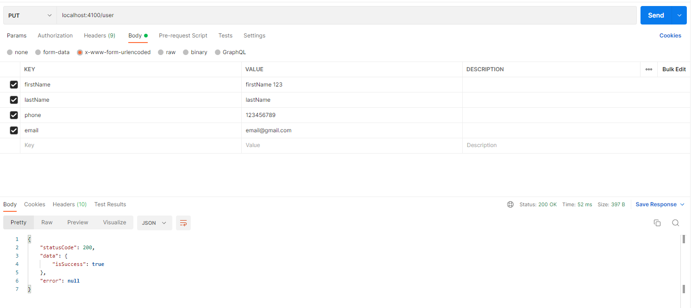

# How to run

## Step 1: prepare DB
* Create database at local
* Update database information in file `.evn`

## Step 2: install packages
* run script: `yarn`

## Step 3: Starting
* Move to project folder
* run script: `yarn start`

## Step 4: Testing using the Postman
* User register API:  .
* Login API:  .
* Set Authorization:  .
* Change password API:  .
* modify uawe profile API:  .

# Thank you for your review
